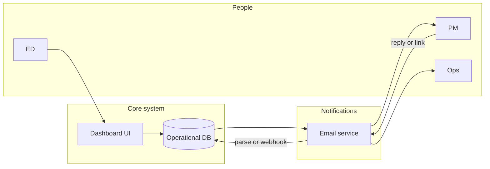

# Dashboard & Operations: Activity Tracking, Email Loop, Accounting Alignment

**Companion to:** `PRD-Workforce-Academy.md` (FR-8, FR-9, FR-10)  
**Goal:** One **system of record** for tasks and KPIs so responsible parties stay on schedule; **email** as the primary nudge layer; **budget** and **planning** visible in the same place.

**Pilot decisions:** Stakeholders want **broad visibility**; **v1 default** remains **safest** — **aggregates** for pastors/funders; **PII** limited to **core** (Brian, Earl, Cynthia, board finance) until policy is written. See **`CRM-MVP-SPEC.md`**.

**Implementation:** **Next.js + Prisma + SQLite** scaffold under [`crm/`](../crm/README.md); extend with auth and role-based views before production use.

---

## 1. Principles

1. **Single source of truth** — No “shadow” task lists; if it matters, it lives in the database (with exceptions for legally privileged items in counsel-only stores).  
2. **Owner + due date + status** on every actionable item.  
3. **Inbound updates** must be **low friction** (reply to email or one-tap link).  
4. **Audit trail** for money and placement outcomes.

---

## 2. Conceptual architecture

**Implementation options (pick one for v1):**

| Approach | Pros | Cons |
|----------|------|------|
| **Airtable / Smartsheet + Zapier** | Fast, email notifications built-in | Scale, role complexity |
| **Notion + automation** | Cheap, flexible | Weak native email ingest |
| **HubSpot / Salesforce nonprofit** | CRM-grade | Cost, setup |
| **Custom app** (Postgres + Next.js + Resend/SendGrid) | Full control | Build time |

**Selected for this project (MVP):** custom app — **SQLite + Prisma + Next.js** (`crm/`). Migrate to hosted Postgres/Turso if serverless or scale requires it.

**Email-to-database patterns:**

| Pattern | How it works | Best for |
|---------|----------------|----------|
| **Magic-link task page** | Email contains unique URL → user updates status in browser | v1 (simplest, most reliable) |
| **Structured reply** | Subject line `[TASK-123] DONE` or reply templates | Power users |
| **Inbound parse webhook** | SendGrid/Mailgun parse → API → DB | v2 (requires dev) |
| **Form link in email** | Pre-filled Google/Typeform | Quick, no parse |

**Recommendation for v1:** **Magic links + weekly digest**; avoid fragile email parsing until you have a developer.

---

## 3. Data model (minimum entities)

### 3.1 Core

| Entity | Key fields |
|--------|------------|
| **Site** | `site_id`, name, address, tier (T1–T4), pastor contact |
| **Person** | name, email, phone, role(s), `site_id` |
| **Task** | `task_id`, title, description, owner_id, due_date, status, priority, related_site, related_cohort, source (launch plan / ad hoc) |
| **TaskEvent** | timestamp, user, old_status, new_status, note |

### 3.2 Program

| Entity | Key fields |
|--------|------------|
| **Cohort** | `cohort_id`, site_id, start/end, target enrollment |
| **Student** | PII controls; enrollment status, attendance % |
| **Employer** | company, sector tier, status, last_contact_date |
| **EmployerTouch** | date, rep, channel (call/email/visit), outcome code |
| **Placement** | student_id, employer_id, interview_date, offer_date, wage, start_date |

### 3.3 Money

| Entity | Key fields |
|--------|------------|
| **BudgetLine** | site_id or central, category, annual budget |
| **Expense** | date, amount, vendor, budget_line_id, grant_allowable (Y/N), receipt_url |
| **Grant** | name, deadline, status, required match |

---

## 4. Dashboard views

| View | Audience | Content |
|------|----------|---------|
| **Executive** | ED, board | RAG by site, cash runway, placement %, top risks |
| **PM daily** | PM | Today’s tasks, call quota, stale leads, blockers |
| **Ops** | Ops, instructor | Equipment, safety open items, session schedule |
| **Finance** | Finance, ED | Budget vs actual, grant deadlines |
| **Partner** | Optional external | Aggregated impact only—no sensitive PII |

**RAG rules:** Pull from `EXECUTION-PLAN.md` weekly scorecard thresholds.

---

## 5. Email cadence (templates to author)

| Email | Trigger | Recipients |
|-------|---------|------------|
| **Daily digest** | 7 AM local | PM: tasks due today + overdue |
| **Owner nudge** | Task due in 24h | Task owner |
| **Overdue escalation** | Task 1 day past due | Owner + PM + ED (configurable) |
| **Weekly rollup** | Monday | ED: all sites KPI + budget snapshot |
| **Monthly finance** | 1st | Finance: close tasks, receipt gaps |

Each email should include **one primary CTA**: “Update this task” (magic link).

---

## 6. Security & privacy

- Role-based access: **student PII** limited to Admin + Instructor + PM as needed.  
- **Employer** and **financial** exports watermarked or logged.  
- Retention policy aligned with grants and HR law (define with counsel).

---

## 7. Integration with accounting

- **Expense** records either **export to QuickBooks** (CSV/API) or **mirror** category monthly.  
- **In-kind** church space: document hours × fair market rate for grant reports (validate method with accountant).  
- **Board packet:** auto PDF monthly from dashboard + finance attachment.

---

## 8. Rollout checklist

- [ ] Choose platform (Airtable vs custom, etc.)  
- [ ] Import task list from `EXECUTION-PLAN.md`  
- [ ] Create roles and test permissions  
- [ ] Configure email templates + magic links  
- [ ] Pilot with PM + one site for 2 weeks  
- [ ] Add finance module after tasks stable  

---

## 9. Revision log

| Version | Date | Changes |
|---------|------|---------|
| 1.0 | 2026-04-04 | Initial spec |
